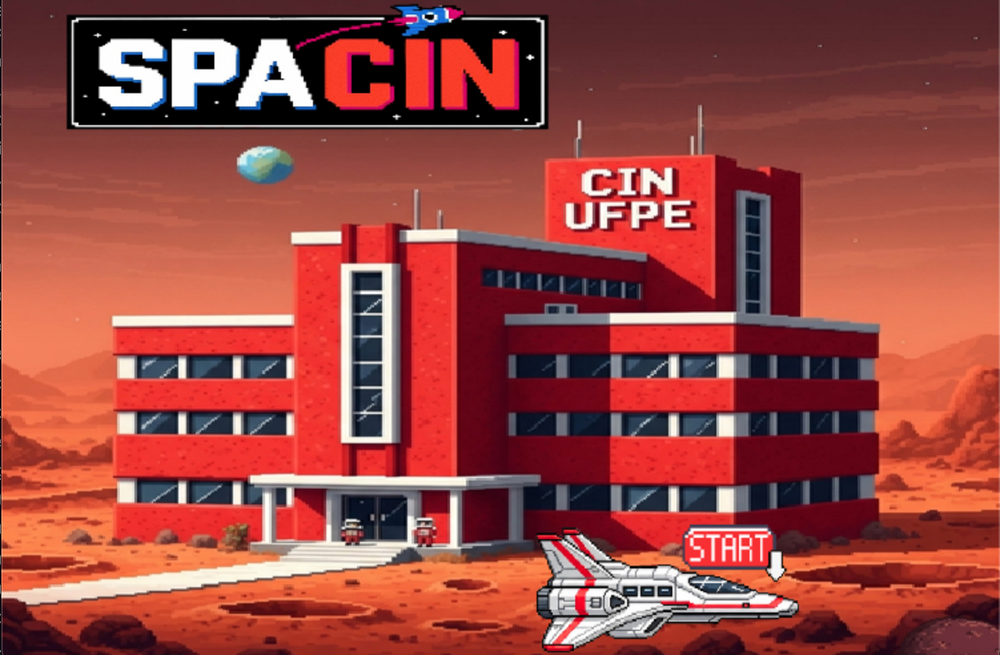
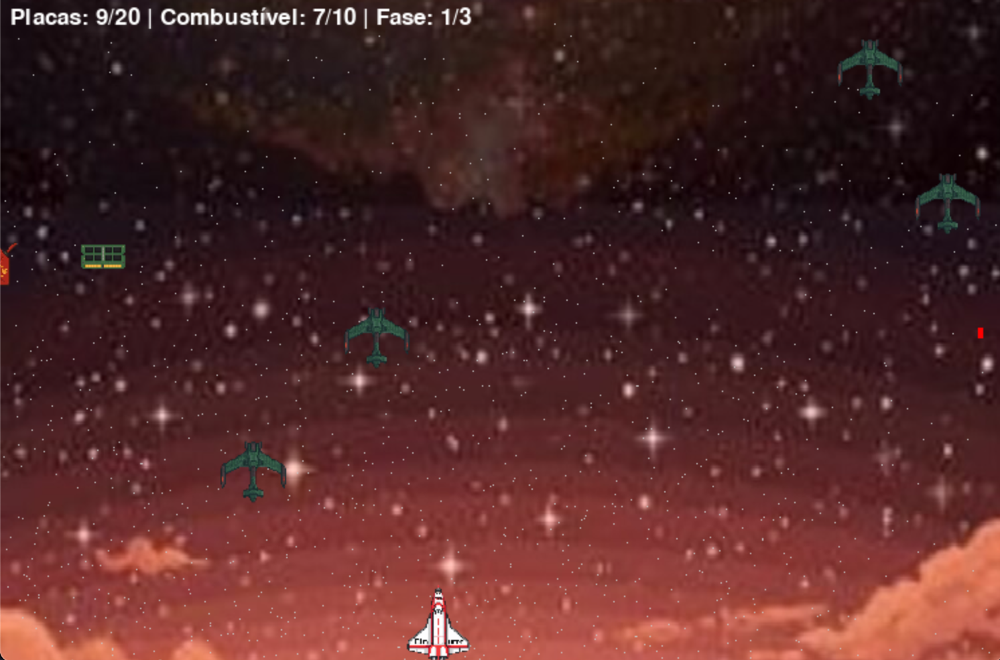
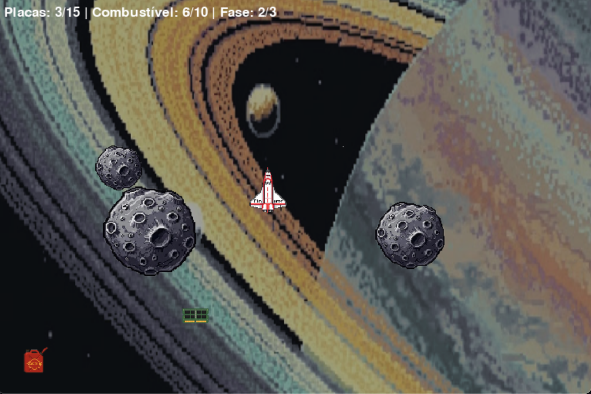
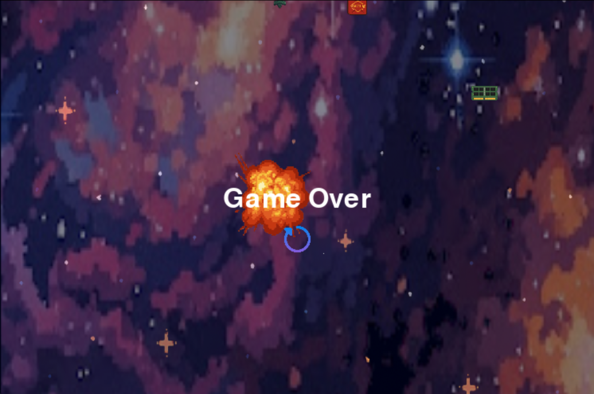

# 🚀 SpaCIn - Uma Odisséia Espacial

Este projeto é um jogo de nave no estilo *collectathon*, inspirado em clássicos como **Space Invaders** e **Subway Surfers**. Desenvolvido como parte da disciplina de **Introdução à Programação**, o jogo desafia o jogador a sobreviver a uma chuva de asteroides e inimigos, testando seus reflexos e habilidades enquanto ele coleta placas para avançar de fase e combustível para continuar voando.

---

## 👥 Membros da Equipe
- **Daniel Acioly** `<dgla>`
- **Guilherme Valença** `<gvs2>`
- **Gustavo Leão** `<gjcln>`
- **João Gabriel Caldas** `<jgmc>`
- **Lucas Mendonça** `<lcm>`
- **Luís Felipe Durães** `<lflld>`

---

## 🏗 Arquitetura do Projeto

O código foi organizado seguindo os princípios da **Programação Orientada a Objetos (POO)**, garantindo modularidade, legibilidade e facilidade de expansão.  
A estrutura principal é dividida em classes, cada uma com uma responsabilidade única:

- **`inimigos.py`** → Lógica dos inimigos e seus tiros.  
- **`Projeto_de_IP.py`** → Código principal do jogo (colisões, tiros, movimentações, geração de coletáveis, limites e masks).  
- **`asteroides.py`** → Lógica dos asteroides.  
- **`coletaveis.py`** → Lógica dos coletáveis (placas e galões de combustível).  
- **`dados.py`** → Exibe quantidade de placas, combustível e fase.  
- **`final.py`** → Lógica de fim de jogo e avanço de fase (inclui música).  
- **`fundo.py`** → Movimento do plano de fundo.  
- **`game_over.py`** → Tela de fim de jogo e música.  
- **`restart.py`** → Reinício do jogo após o fim.  
- **`settings.py`** → Configurações básicas.  
- **`ship.py`** → Lógica da nave do jogador (movimento e colisões).  
- **`stars.py`** → Movimento das estrelas no plano de fundo.  
- **`story.py`** → Integra história, menu e jogo.  
- **`tela_menu.py`** → Tela de menu principal.  
- **Pastas de mídia** → Imagens e áudios usados no jogo.  

---

## 🛠 Ferramentas e Bibliotecas

- **Python 3** → Linguagem versátil e poderosa, ideal para aprendizado e desenvolvimento rápido.  
- **Pygame** → Biblioteca para jogos 2D em Python (janelas, sprites, eventos, FPS).  
- **Git & GitHub** → Controle de versão e trabalho em equipe (branches para funcionalidades independentes).  

---

## 📌 Divisão de Trabalho

- **Felipe** → Classe de asteroides  
- **Gustavo** → Classe de coletáveis e músicas  
- **João** → Classe da nave e do fundo  
- **Lucas** → Classe dos inimigos  
- **Daniel** → Classe e lógica do menu e geração de imagens  
- **Guilherme** → Geração de imagens e lógica de fim de jogo  
- **Todos** → Integração e ajustes no código principal  

---

## 💡 Conceitos Utilizados

- Estruturas condicionais `if/else`
- Laços `for` e `while`
- Funções bem definidas para modularidade
- Uso de classes para organização do código

---

## ⚠️ Desafios e Lições Aprendidas

- **Principal desafio** → Definição da ideia central e controle de escopo do projeto.  
- **Principal erro** → Uso incorreto do GitHub e branches (baixa familiaridade inicial).  
- **Lição aprendida** → Trabalho em equipe eficaz e aprendizado rápido das ferramentas e bibliotecas.  

---

## 🖼 Galeria

_Aqui você pode ver imagens do jogo:_

  
  

  
  

